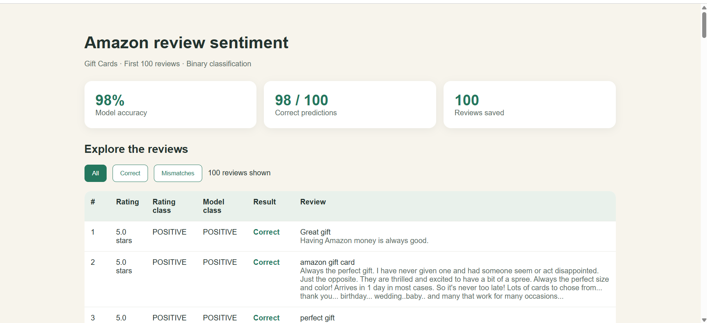

# Amazon Review Classifier

This project classifies Amazon gift card reviews by sentiment and compares model predictions with labels based on star ratings.

## Binary classification

The first 100 reviews were labeled positive for ratings of 4–5 stars and negative otherwise. The model classified 98 of 100 correctly (98%). The sample contained 93 positive and 7 negative reviews, so an always-positive baseline would have scored 93%.

## Three-class classification

A reproducible sample of 150 reviews was selected from the full dataset using random seed 123: 50 positive (4–5 stars), 50 neutral (3 stars), and 50 negative (1–2 stars).

The model classified 109 of 150 correctly (72.7%):

| Actual class | Correct | Accuracy |
| --- | ---: | ---: |
| Positive | 46/50 | 92% |
| Neutral | 15/50 | 30% |
| Negative | 48/50 | 96% |

An always-one-class baseline scores 50/150 (33.3%) on this balanced sample. Neutral reviews were the hardest. For example, a review that described an easy process but complained about a missing $5 credit was labeled neutral by its 3-star rating, while the model predicted negative.

### Where the three-class model made mistakes

Rows are the rating-based labels; columns are the model's predictions.

| Actual \ Predicted | Positive | Neutral | Negative |
| --- | ---: | ---: | ---: |
| Positive | 46 | 4 | 0 |
| Neutral | 7 | 15 | 28 |
| Negative | 1 | 1 | 48 |

The largest error was neutral reviews being called negative (28 of 50). The model also called 7 neutral reviews positive. Positive and negative reviews were rarely confused directly with each other: no positive reviews were called negative, and only one negative review was called positive.

## Emotion comparison

The LLM predicted a primary emotion for the first 100 reviews. Separately, the NRC word-list method counted emotion-linked words in each review and selected the highest-scoring emotion when there was one clear winner.

The word list produced one clear emotion for 33 of 100 reviews. The LLM and word list agreed on 20 of those 33 (60.6%). The remaining 67 reviews had tied top word-list scores or no matching emotion words, so no single word-list emotion could be compared. The methods can differ because the word list counts individual words, while the LLM can use the surrounding context, such as a complaint mixed with praise.

## Data and emotion-word sources

- Amazon Reviews 2023, McAuley Lab: https://amazon-reviews-2023.github.io/
- Gift Cards review data: https://mcauleylab.ucsd.edu/public_datasets/data/amazon_2023/raw/review_categories/Gift_Cards.jsonl.gz
- NRC Emotion Lexicon: https://www.saifmohammad.com/WebPages/NRC-Emotion-Lexicon.htm

The downloaded review data and NRC lexicon are kept in the local `data/` folder and are excluded from this repository.

## Files

- `main.py`: Runs the binary classifier.
- `analyze_binary.py`: Summarizes binary results.
- `dashboard.py`: Builds the interactive binary dashboard.
- `balanced_sample.py`: Selects the balanced three-class sample.
- `three_class_model.py`: Runs the three-class classifier.
- `analyze_three_class.py`: Summarizes three-class results.
- `three_class_chart.py`: Builds the accuracy chart.

## Dashboard screenshot

## How to run

Use Python 3. Run the commands below from the `amazon-review-classifier` folder. Set `MBAX6418_API_TOKEN` in your terminal before running a script that calls the class model endpoint.

1. Run `python main.py` to download the Gift Cards data and create the binary results.
2. Run `python analyze_binary.py` to summarize the binary run.
3. Run `python dashboard.py` to generate `dashboard.html`.
4. Download the NRC Emotion Lexicon and place its word-level text file in `data/`.
5. Run `python emotion_model.py` and `python wordlist_emotions.py` for the emotion comparison.
6. Run `python balanced_sample.py` to select 50 reviews per sentiment class.
7. Run `python three_class_model.py` to classify the balanced sample.
8. Run `python analyze_three_class.py` and `python three_class_chart.py` to produce the analysis and chart.

The model scripts save their output as JSON. The three-class script saves after each review and resumes from its saved results if interrupted.

## Issues and fixes

The initial 100 reviews were heavily positive, making overall accuracy look high even for an always-positive baseline. Sampling 50 reviews from each class exposed the model's difficulty with neutral reviews. During the three-class run, the model sometimes returned an empty response; the script was updated to retry and save progress after each review. The NRC word list often produced ties or no match, which were kept separate from clear emotion disagreements. A terminal launch issue in VS Code was avoided by running commands in the existing Git Bash terminal.